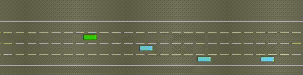

# Highway Agent (Highway-Env) — CNN Policy from Gridworld Supervision

**Author:** Muhammed Abdulkadir Günay  
**Course Project:** Applied Reinforcement Learning (Gymnasium Track A — Highway-Env)

<p align="center">
  
</p>

**Three stages shown in the video (exactly 3):**
1. **Untrained:** random / fails quickly  
2. **Half-Trained:** shows improvement but still crashes  
3. **Fully Trained:** drives safely and fast through dense traffic

---

## 1) Objective

Train an autonomous driving agent in **highway-env** to:
- drive **as fast as possible**
- in **dense traffic**
- while **avoiding collisions**

This is a multi-objective problem: **Speed vs. Safety**.

---

## 2) Environment & Interface

### Highway environment
- **Env:** `highway-v0` (Gymnasium)
- **Traffic:** dense (vehicles_count is high)
- **Episode length:** fixed duration in steps

### What the agent "sees" (State)

The agent observes a **local Occupancy Grid** centered around the ego vehicle.  
Highway-env’s `OccupancyGrid` observation is a **7×7 grid** (with multiple feature channels), which can include:

- **presence** (occupied cells / nearby vehicles)
- **vx, vy** (relative velocities)
- **on_road** (whether each cell belongs to the drivable road region)

However, the policy does **not** consume the full 7×7 multi-feature grid directly.  
Instead, we convert it into a compact **(2, 4, 7)** tensor aligned with our Gridworld abstraction:

- Channel 0: **obstacles** (boolean 0/1), extracted from `presence` and restricted to the **4 road/lane rows**
- Channel 1: **ego position** (one-hot), placed at a fixed center column

So the final network input is:

$$
s \in \mathbb{R}^{2 \times 4 \times 7}
$$

This conversion intentionally discards extra channels (e.g., raw velocity fields) and off-road rows, keeping only the essential road geometry needed by the learned policy.


### What the agent "does" (Actions)
The agent outputs one of **4 discrete actions**:

| ID | Action |
|---:|--------|
| 0 | **FWD** (speed-up then stabilize: macro = `[3, 1, 1, 4]`) |
| 1 | **BWD** (slow-down then stabilize: macro = `[4, 1, 1, 3]`) |
| 2 | **LEFT** (lane change left, extended hold) |
| 3 | **RIGHT** (lane change right, extended hold) |

> Note: FWD/BWD are not pure “accelerate forever” actions. They apply a short speed change and then return toward stable driving, which helps avoid oscillations in dense traffic.

These are mapped to highway-env’s **DiscreteMetaAction** using **macro-actions** (multiple env steps per decision) so lane changes have enough time to complete.

---

## 3) Methodology

### Key idea (System 2)
Instead of directly training PPO end-to-end on highway-env, I built a **policy**:

1. Create a small **Gridworld MDP** (4×7) with:
   - terminal goal on the rightmost column
   - crash terminal states
   - finite-horizon (timeout)
2. Solve it using **finite-horizon dynamic programming** to get the optimal action label:
   $$
   a^* = \arg\max_a Q(s,a)
   $$
3. Generate a large supervised dataset of (grid → optimal action).
4. Train a CNN classifier to imitate the solver (behavior cloning).

This produces a fast, stable policy for highway-env from structured supervision.

> Important note: The Gridworld MDP is an **optimistic simplification** of the real highway environment.  
> It captures local obstacle avoidance and progress on a discrete grid, but it cannot fully represent continuous dynamics, multi-agent interactions, or all edge cases in highway-env.

---

## 4) Reward Function (Gridworld MDP)

The dataset labels come from an MDP defined on the 4×7 grid.

**Living reward (per step):**
$$
r_{\text{living}} = -0.10
$$

**Crash terminal:**
$$
r_{\text{crash}} = -1.0
$$

**Goal terminal:**
Goal is reaching the rightmost column. Reward depends on row:
$$
r_{\text{goal}}(row) \in \{1.00, 1.05, 1.10, 1.15\}
$$

**Discount factor:**
$$
\gamma = 0.90
$$

**Finite horizon:**
Episode ends if:
- crash
- goal
- timeout (max steps)

---

## 5) Model Architecture (CNN)

Input: \((2,4,7)\)

- Conv2D → ReLU
- Conv2D → ReLU
- Flatten
- Linear → ReLU
- Linear → logits (4 actions)

The model is implemented in `src/cnn_policy.py`.

---

## 6) Training Setup

### Dataset
- Balanced across actions (FWD/BWD/LEFT/RIGHT)
- Saved as compressed NPZ:
  - `data/80Kdataset.npz` (not committed to repo)

### Full model
- Trained on the full dataset for multiple epochs

### Half / Weak model (for the evolution video)
The “Half-Trained” model is intentionally weaker:
- uses a **small fraction of the training split**
- trains for **few epochs**

This produces a policy that **starts to learn** but still crashes sometimes.

---

## 7) Training Analysis

A classic “reward vs episode” curve is not included because this project uses **supervised imitation** (behavior cloning) rather than online RL training in highway-env.

Instead, training is evaluated using **validation accuracy** on a held-out split of the generated dataset.

**Observation:**  
- Because the dataset is large and highly structured, the model reaches high accuracy very quickly (≈0.95 even in the first epoch).  
- After that, improvements are marginal; the last epochs are very close to each other.

*(Plot omitted: accuracy saturates early due to the structured dataset; logs are available in the training output.)*

---

## 8) Challenges & Fixes

### Issue 1: Correctly sizing the OccupancyGrid around the ego vehicle
Initially, I assumed the grid bounds could be set by simply choosing “4 cells ahead and 3 cells behind”.
However, highway-env’s OccupancyGrid is defined **relative to the ego-centered coordinate system**, meaning the grid must be sized using the ego-centered metric frame.

**Fix:**  
I recomputed the X bounds using the actual grid step:
- `x_step = 15m`, 7 columns total ⇒ symmetric bounds around the ego center  
- final choice: `x_min = -52.5`, `x_max = +52.5`

This ensured a consistent, correct spatial discretization for the 7×7 grid.

### Issue 2: Lane-change instability due to grid shifting + decision timing
During lane changes, the ego vehicle can be temporarily between lanes. Because the OccupancyGrid is ego-centered, the perceived grid can “shift” and other vehicles may fall near cell boundaries. At the same time, the agent was making a new decision too quickly before the lane change fully completed.

**Fix:**  
I changed the macro-action timing:
- **FWD/BWD** decisions: new decision after **~1 second**
- **LEFT/RIGHT** (lane changes): new decision after **~2 seconds**  
This reduced mid-lane oscillation and produced smoother, safer lane changes.

---

## 9) How To Run

### 1) Install dependencies
```bash
  pip install -r requirements.txt
```

### 2) Train model
```bash
  python -m src.train_cnn
```

### 3) Test model
```bash
  python -m src.record_video_sim
```

### 4) Evaluate model (optional)
```bash
  python -m src.eval_cnn
```
